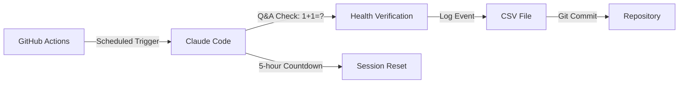

# 🤖 Claude Code Session Reset Scheduler

> **Automated session management system that ensures fresh Claude Code quotas during your working hours**

A GitHub Actions-powered scheduler that automatically triggers Claude Code session resets at optimal times, maintaining a 5-hour countdown to ensure new quotas are available when you need them most. Features health monitoring through simple Q&A checks.

---

## ✨ Key Features

- **🔄 Automatic Session Management** - Triggers 4 daily resets aligned with work periods
- **⏰ Smart Timing** - 5-hour countdown ensures sessions refresh during productive hours
- **🧪 Health Monitoring** - Built-in Q&A checks verify system functionality
- **🔐 Multi-Token Support** - Configure backup tokens for reliability
- **📊 Activity Logging** - Track all resets in monthly CSV logs

---

## 📅 Default Schedule (UTC+8 Timezone)

The system triggers session resets **5 hours before** your target work periods:

| 🕐 Trigger | ⏰ Session Resets  | 💼 Work Period Coverage |
| :--------- | :----------------- | :---------------------- |
| **05:23**  | **10:00 AM**       | Morning (8:00-12:00)    |
| **10:23**  | **3:00 PM**        | Afternoon (1:00-5:00)   |
| **17:23**  | **10:00 PM**       | Evening (8:00-12:00)    |
| **22:23**  | **3:00 AM** (next) | Late night coverage     |

---

## 🚀 Quick Start

### Step 1: Get the Repository

Choose one option:

**Option A: Fork (Recommended for personal use)**

```bash
# 1. Fork this repo on GitHub
# 2. Clone your fork
git clone https://github.com/codeotter0201/claude-daily-check-in.git
cd claude-daily-check-in
```

**Option B: Clone directly**

```bash
git clone https://github.com/codeotter0201/claude-daily-check-in.git
cd claude-daily-check-in
```

### Step 2: Generate OAuth Token

```bash
claude setup-token
```

Copy the generated `oauth_token_...` value.

### Step 3: Add to GitHub Secrets

1. Navigate to: **Settings** → **Secrets and variables** → **Actions**
2. Create new secrets:

| Secret Name                 | Value                   | Required    |
| :-------------------------- | :---------------------- | :---------- |
| `CLAUDE_CODE_OAUTH_TOKEN_1` | Your first OAuth token  | ✅ Yes      |
| `CLAUDE_CODE_OAUTH_TOKEN_2` | Your second OAuth token | ⭐ Optional |

### Step 4: Done!

✅ The scheduler is now active and will run automatically based on the default schedule.

- First trigger will happen at the next scheduled time
- Check the **Actions** tab in your GitHub repository to monitor runs
- No push needed unless you modify the schedule

---

## ⚙️ Customizing Schedule Times

### Understanding the Timing System

Each trigger initiates a 5-hour countdown. The formula is:

```
Trigger Time + 5 hours = Session Reset Time
```

### Quick Examples

<details>
<summary><b>📝 Click for Common Schedule Configurations</b></summary>

#### Single Daily Reset (9:00 AM)

```yaml
schedule:
  - cron: "23 20 * * *" # Triggers at 4:23 AM → Resets at 9:00 AM
```

#### Twice Daily (10:00 AM & 4:00 PM)

```yaml
schedule:
  - cron: "23 21,3 * * *" # Triggers at 5:23 AM & 11:23 AM
```

#### Business Hours (9:00 AM, 2:00 PM, 7:00 PM)

```yaml
schedule:
  - cron: "23 20,1,6 * * *" # Triggers 5 hours before each
```

</details>

### How to Modify Schedule

1. **Edit** `.github/workflows/auto-checkin.yml`
2. **Find** the schedule line (~line 12):
   ```yaml
   - cron: "23 21,2,9,14 * * *" # Current schedule
   ```
3. **Calculate** your times:
   - Choose reset times (in your timezone)
   - Subtract 5 hours for trigger times
   - Convert to UTC
   - Use `:23` minutes (avoids congestion)
4. **Push your changes** to apply the new schedule:
   ```bash
   git add .github/workflows/auto-checkin.yml
   git commit -m "Update schedule times"
   git push origin main
   ```

<details>
<summary><b>🌍 Time Zone Conversion Helper</b></summary>

| Your Reset Time (UTC+8) | Trigger Time (UTC+8) | Cron Hour (UTC) |
| :---------------------- | :------------------- | :-------------- |
| 9:00 AM                 | 4:23 AM              | 20              |
| 10:00 AM                | 5:23 AM              | 21              |
| 2:00 PM                 | 9:23 AM              | 1               |
| 3:00 PM                 | 10:23 AM             | 2               |
| 7:00 PM                 | 2:23 PM              | 6               |
| 10:00 PM                | 5:23 PM              | 9               |

</details>

---

## 🧪 Testing Your Setup

### Via GitHub Actions (Recommended)

1. Go to **Actions** tab
2. Select **"Claude Code Session Reset Scheduler"**
3. Click **"Run workflow"**

### Local Testing

```bash
# Test Q&A functionality
uv run --python 3.13 python src/log_qa_check.py --token TOKEN_1

# View logs
cat logs/$(date +%Y%m)-session-log.csv
```

---

## 📊 Session Logs

Monthly CSV files track all activities:

**Location:** `logs/YYYYMM-session-log.csv`

**Format:**

```csv
timestamp,event_type,token_id,reset_time_utc8
2025-09-04 05:24:27,SESSION-RESET-TRIGGER,TOKEN_1,2025-09-04 18:24:27
```

---

## 🛠️ Architecture

### System Flow



### Project Structure

```
📁 claude-daily-check-in/
├── 📁 .github/workflows/
│   └── 📄 auto-checkin.yml         # Scheduler configuration
├── 📁 src/
│   └── 🐍 log_qa_check.py          # Q&A & logging script
├── 📁 logs/                        # Session records
│   └── 📊 YYYYMM-session-log.csv
├── 📄 README.md                    # This file
└── 📄 ADR-*.md                     # Architecture decisions
```

---

## 🔧 Advanced Configuration

### Multiple Token Setup

Benefits of using multiple tokens:

- ✅ **Redundancy** - Backup if one fails
- ✅ **Load Distribution** - Parallel processing
- ✅ **Tracking** - Individual token monitoring

---

## 🐛 Troubleshooting

<details>
<summary><b>❌ OAuth Token Error</b></summary>

**Error:** `Could not fetch an OIDC token`

**Solutions:**

- Regenerate token: `claude setup-token`
- Verify secret names match exactly
- Check GitHub Actions has `id-token: write` permission
</details>

<details>
<summary><b>⏰ Wrong Reset Times</b></summary>

**Checklist:**

- GitHub Actions uses UTC (not local time)
- The 5-hour countdown is automatic
- GitHub may delay execution by several minutes
- Check timezone conversion calculations
</details>

<details>
<summary><b>📝 No Logs Created</b></summary>

**Debug Steps:**

```bash
# Check Claude status
claude --version
claude auth status

# Test locally
claude -p "1+1=?"

# Manual trigger
uv run --python 3.13 python src/log_qa_check.py --token TOKEN_1
```

</details>

---

## 📈 Monitoring

### Health Checks

- ✅ **GitHub Actions** - Review workflow runs
- ✅ **CSV Logs** - Verify monthly records
- ✅ **Git History** - Check automated commits
- ✅ **Session Availability** - Monitor actual resets

### Maintenance Tasks

- 📅 **Monthly** - Review log files
- 🔄 **Quarterly** - Rotate OAuth tokens
- 📊 **As Needed** - Adjust schedule based on usage

---

## 🔒 Security

⚠️ **Important Security Practices:**

- Never hardcode tokens in code
- Use GitHub Secrets for sensitive data
- Rotate OAuth tokens regularly
- Limit repository access permissions

---

## 🤝 Contributing

We welcome contributions! Please:

1. Fork the repository
2. Create a feature branch
3. Make your changes
4. Submit a pull request

---

## 📝 Version History

### v2.2.0 (Current)

- ✅ Integrated Q&A health checks
- ✅ Enhanced logging with reset time calculations
- ✅ Local testing capabilities

### v2.1.0

- ✅ Optimized cron timing (`:23` minutes)
- ✅ Reliability improvements

### v2.0.0

- ✅ Complete rewrite for session management
- ✅ Smart scheduling for work periods

---

## 📚 Documentation

- [ADR-001: Session Reset Schedule](./ADR-001-session-reset-schedule.md)
- [ADR-002: Timing Optimization](./ADR-002-github-actions-cron-timing-optimization.md)
- [ADR-003: Q&A Health Checks](./ADR-003-simple-qa-logging-feature.md)
- [Official Documentation](./DOC.md)
- [Product Requirements](./PRD.md)

---

<div align="center">
  <i>Built with ❤️ for productive Claude Code sessions</i>
  <br>
  <sub>Based on architecture decisions optimized for reliability and user convenience</sub>
</div>
